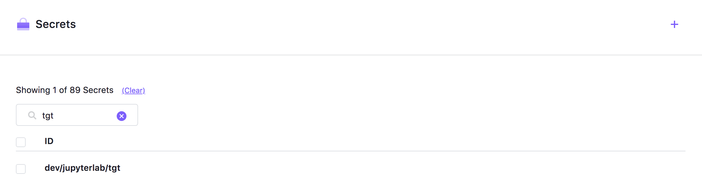
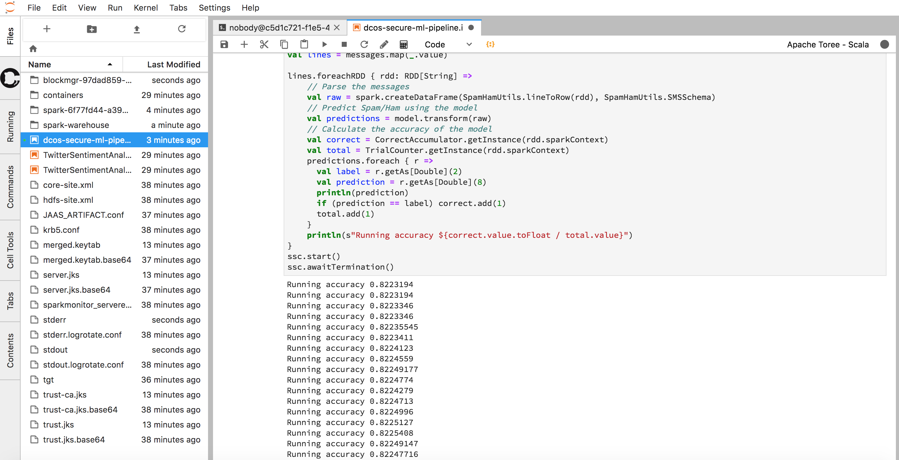
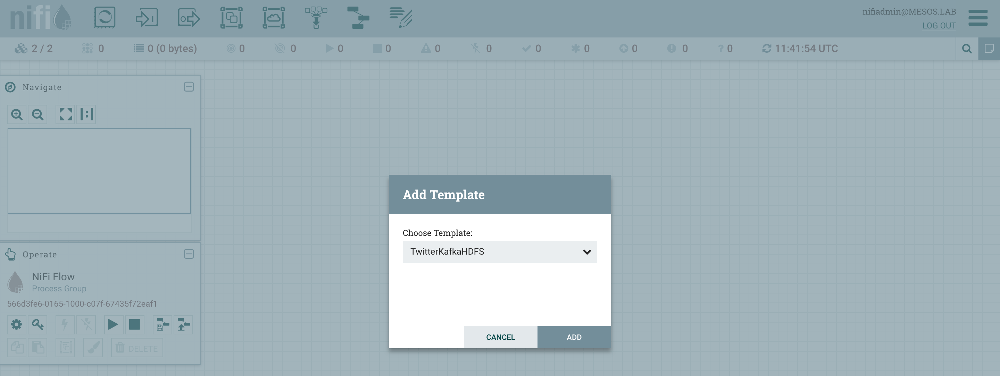
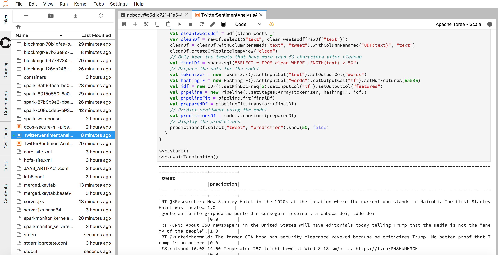

# DC/OS Secure ML Pipeline v2

In the [first version](https://github.com/djannot/dcos-secure-ml-pipeline), I was explaining how to deploy Apache HDFS, ZooKeeper, Kafka and Spark with TLS and Kerberos.

And I was using a simple Spam/Ham Scala Application to demonstrate how to deploy Spark jobs using the DCOS CLI (**dcos spark run**).

In this new version, I've added Apache NIFI and the [Jupyter](http://jupyter.org/) notebook to provide additional capabilities and a better user experience.

The previous demo (Smam/Ham) is also available in this repo.

## Prerequisites

You need to provision a DC/OS Enterprise Edition cluster in either `permissive` or `strict` mode.

A DC/OS cluster with at least 10 private agents providing 40 CPU and 128 GB of RAM is required.

If you deploy it in strict mode, you need to setup the DCOS cli using `https` (dcos cluster setup `https://`).

To run the new Twitte demo, you need to obtain your Twitter Consumer and Access Keys and Secrets.

You can obtain them by appling for a Twitter developer account at [https://developer.twitter.com/en/apply-for-access](https://developer.twitter.com/en/apply-for-access).

You then need to wait before Twitter approves it.


## Deployment

You simply need to execute the following command:

```
./deploy-all.sh
```

It will deploy Apache HDFS, Kafka (with its own dedicated ZooKeeper), Spark, NIFI and Jupyter with Kerberos and TLS.

A `KDC` will also be deployed, but if you'd like to reuse the same approach to deploy this stack in production, you would skip this step and use your own KDC (which could be Active Directory, for example).

## Spam/Ham (legacy) demo

This is the demo that was available in the previous [repo](https://github.com/djannot/dcos-secure-ml-pipeline)

The `deploy-all.sh` script is executing the `create-model.sh` and `generate-messages.sh` scripts.

The `create-model.sh` script creates the model using Spark and the `SMSSpamCollection.txt` text file that contains examples of spams and hams. This file has already been uploaded to an Amazon S3 bucket to simplify the process. 

The model is stored in `HDFS`.

The `generate-messages.sh` script generates new random messages. It is another Spark job and it's also leveraging the `SMSSpamCollection.txt` file to generate them. These messages are produced in Kafka.

### Option 1 (legacy) - classify the messages using `dcos spark run`

Finally, you can run the following script to use the model previously created to classify the incoming messages. It will consume the messages from Kafka and will display the accuracy of the process in `stdout`.

```
./classify-messages.sh
```

To access `stdout`, you click on the arrow close to the Spark service:

 

Then, you click on the `Sandbox` link corresponding to the `SpamHamStreamingClassifier` driver:


Finally, you click on `stdout`:


You can see the accuracy displayed at the end of the log:


Stop the Spark job using `dcos spark kill` to free resources.

The 3 Spark jobs are using a jar file that has also been uploaded to an Amazon S3 bucket to simplify the process.

The source code is available [here](https://github.com/djannot/spark-build/blob/master/tests/jobs/scala/src/main/scala/SpamHam.scala).

The `hdfs-client.txt` and the `kafka-client.txt` files are showing the commands you need to use if you want to check the files stored in HDFS and the messages produced in Kafka.

A video going through the full demo is available on YouTube [here](https://www.youtube.com/watch?v=WMISqFRk28E).

### Option 2 (new) - classify the messages using the Jupyter notebook

One of the advantage of this approach is that a data scientist can work on his code and submit it without compiling a new jar.

Run the following command to launch it in your web browser:

```
./open-jupyterlab.sh
```

The password is `jupyter`


Click on the `Terminal` icon and run the following command:

```
klist
```

The output should be as below:

```
Ticket cache: FILE:/tmp/krb5cc_65534
Default principal: client@MESOS.LAB

Valid starting       Expires              Service principal
08/16/2018 10:43:02  08/17/2018 10:43:02  krbtgt/MESOS.LAB@MESOS.LAB
```

As you can see, the deployment script has logged you in as `client@MESOS.LAB` (using `kinit -kt merged.keytab client@MESOS.LAB`).

In a real production environment, you would login with your Active director user (for example).

The script has also uploaded the Kerberos TGT (Ticket Granting Ticket) to the DC/OS secret store.



This TGT will be used by Spark to authenticate against Apache Kafka and HDFS.

This is define in the `JAAS_ARTIFACT.conf` file:

```
KafkaClient {
    com.sun.security.auth.module.Krb5LoginModule required
    useKeyTab=false
    useTicketCache=true
    ticketCache="/mnt/mesos/sandbox/tgt"
    renewTGT=true
    serviceName="kafka"
    principal="client@MESOS.LAB";
}; 
```

You can now open the `dcos-secure-ml-pipeline.ipynb` file.


As you can see on the top right corner, this is using the [Apache Toree](https://toree.incubator.apache.org/) - Scala kernel.

Run the 3 first paragraphs.

You should see the result displayed as shown below:



Note that this is not using the DC/OS Spark package.

The Jupyter notebook container is the Spark driver.

Click on `Kernel` -> `Shutdown Kernel` to stop the Spark job.

You can (optionaly and after restarting the Kernel) run the last paragraph to consume the Kafka topic and see the type of messages classified by the model.

## Twitter sentiment analysis (new) demo

In this demo, I'm also leveraging Apache NIFI and the Jupyter notebook to provide additional capabilities and a better user experience.

Apache NIFI is used to listen to the Twitter Streaming API, produce the tweets in Kafka and store them in HDFS.

The Jupyter notebook is then used to create create a model.

Run the following command to launch NIFI in your web browser:

```
./open-nifi.sh
```

Login with `nifiadmin@MESOS.LAB` using the password `password`.


Right click on the background.


Select `Upload template` and upload the `TwitterKafkaHDFS.xml` template.


Drag and drop the template icon and select the `TwitterKafka10HDFS.xml` template.



As you can see, there are few warnings. They are corresponding to the sensitive information that can't be stored in a template.


Double click on the `PublishKafka_0_10` processor.


Then, click on the arrow in the `SSL Context Service` row.


Click on the `Configure` icon.


Indicate `changeit` for the truststore password.


Click on the `Enable` icon and enable it.

Double click on the `Twitter Data Source`.


Then, double click on the `GetTwitter` processor.


Indicate your Consumer and Access Keys and Secrets.

Select all the components and click on the play button.


After few minutes, click on the stop button to make sure you don't write in Kafka more data than the space available on it.

Run the following command to launch the Jupyter notebook in your web browser:

```
./open-jupyterlab.sh
```

The password is `jupyter`


Click on `Help` and select `Launch Classic Notebook`.

We launch the classic notebook to be able to use the `Spark Magic` extension.

Open the `TwitterSentimentAnalysisCreateModel.ipynb` file.


Run the first paragraph.

Update the date in the third paragraph. It should reflect today's date.

Then, click on `Kernel` and select `Restart & Run All`.

Now that we have created a Twitter Sentiment Analsis model and stored it in HDFS, we can apply it the tweets consumed through Kafka.

Click on `Kernel` -> `Shutdown Kernel` to stop the Spark job.

Go back to the default Jupyter Notebook (not the Classic one) and open the `TwitterSentimentAnalysisApplyModel.ipynb` file.


Run the paragraph.



